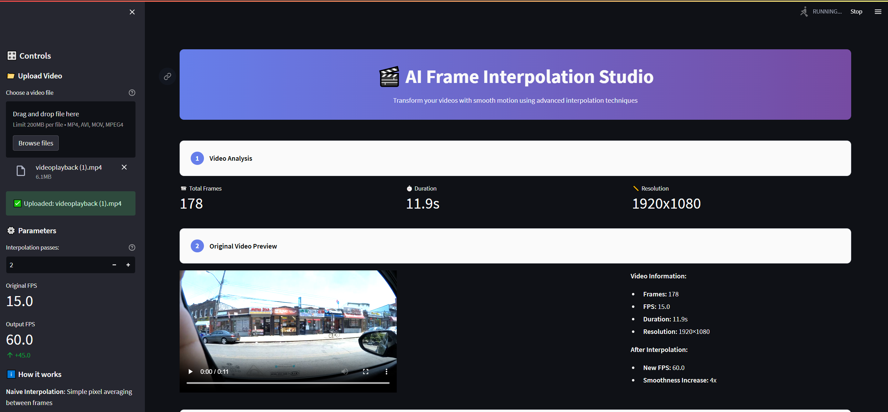

# 🎥 Frame Interpolation App

A Streamlit-based app that lets you compare **naive pixel-averaging** vs. a **deep U-Net** model (with VGG16 perceptual loss) for video frame interpolation. Upload your video, crank up the frame rate, and see the results side-by-side!

  
### Try it yourself here: https://frame-interpolate.streamlit.app/

---

## ⚡ Results

| Original | Deep U-Net Interpolation |
|:--------:|:------------------------:|
| <https://github.com/user-attachments/assets/20e26b67-ca0a-43e8-bc89-e6f30030420b> | <https://github.com/user-attachments/assets/ae518252-e343-495e-913d-7c4c0f6cdac5> |
| <https://github.com/user-attachments/assets/bcd3b165-8b0c-4353-8570-11dd66fd32ea> |


---

## 🏗️ Architecture

- **Model**: Custom U-Net encoder–decoder  
- **Losses**:  
  - L1 pixel loss  
  - VGG16-based perceptual (feature) loss  
- **Training**:  
  - Vimeo90K triplets, 512×512 crops  
  - Adam optimizer, 50 epochs, Cosine LR schedule  

---

## 🛠️ Installation & Running

1. Clone the repo  
   ```bash
   git clone https://github.com/kkakdugee/frame-interpolation.git
   cd frame-interpolation
   ```

2. Install dependencies
   ```bash
   pip install -r requirements.txt
   ``` 

3. Run
   ```bash
   streamlit run app.py
   ```
